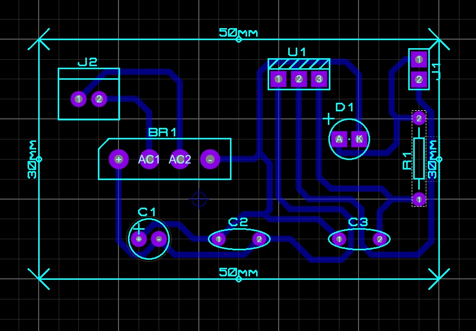

## Funcionamento do PCB ##

### Trilhas e Conexões ###
As trilhas em azul representam as conexões condutoras da PCB, substituindo os fios de ligação em um circuito montado em protoboard. Trilhas mais largas são usadas para conduzir corrente com menor resistência, especialmente na entrada e saída do regulador 7805.

A disposição dos componentes está organizada para garantir um fluxo lógico da corrente: da entrada AC (J2), passando pela ponte retificadora (BR1), pelo capacitor de filtragem (C1), pelo regulador 7805 (U1) e, por fim, saindo pelo conector T1 com 5V DC estabilizados. O LED e o resistor funcionam como um indicativo de que a saída está operacional.

### Conclusão ###
O layout da PCB está bem otimizado para um circuito compacto e funcional. A disposição das trilhas garante conexões curtas e diretas, reduzindo interferências e perdas de energia. Essa placa pode ser fabricada e utilizada como uma fonte confiável de 5V DC para diversos projetos eletrônicos.

